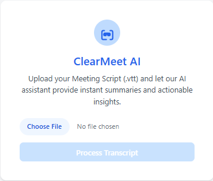
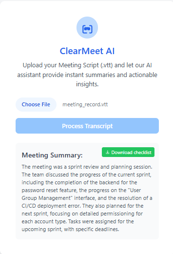

# ClearMeet AI - Meeting Summary Tool

**ClearMeet AI** is a web application that helps you extract key information from your meeting recordings by analyzing `.vtt` transcripts and generating actionable summaries.

---

## How to Use

### 1. Access the Web Application  

  

- Navigate to the ClearMeet AI application.  
- A simple interface with a file upload option will be displayed.

---

### 2. Upload Meeting Transcript  

  

- Click the **"Choose File"** button.  
- Select your meeting transcript file (`.vtt` format only).  
- Only `.vtt` files from meeting recordings are supported.

---

### 3. Process the Transcript  
- After selecting the file, click the **"Process Transcript"** button.  
- Wait for the analysis to complete.  
- The meeting summary will appear below the upload section.

---

### 4. Review and Download Action Items  

  

- Once processing is complete, you will see:  
  - A comprehensive meeting summary  
  - A **"Download Checklist"** button in the top right corner  
- Click the **"Download Checklist"** button to export your CSV file containing the action items.

---

## CSV Output Format

The action items CSV includes:

| Task              | Responsible Person | Deadline     |
|-------------------|--------------------|--------------|
| Task description  | Assignee name      | Due date     |

**Example CSV Output:**  

  

**Column Descriptions:**
- **Task**: Description of the action item.  
- **Responsible Person**: Name of the person assigned to the task.  
- **Deadline**: Due date or expected timeline for task completion.

---

## Note

- Only meeting transcripts in `.vtt` format are supported.
